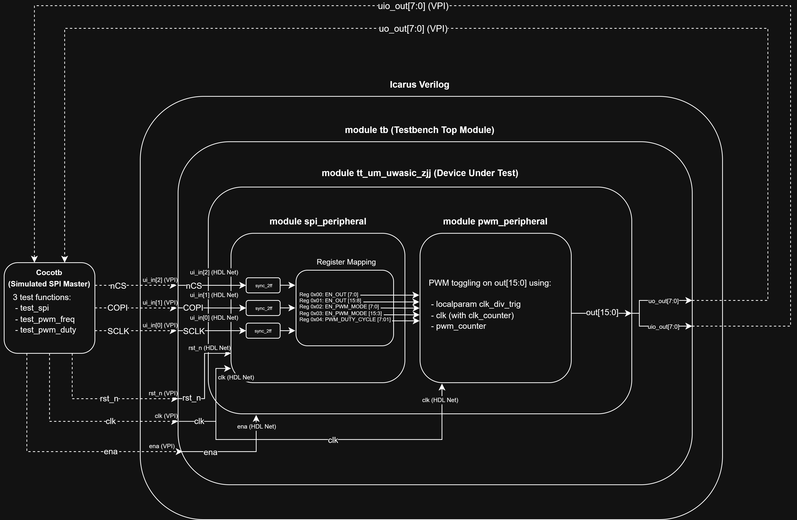
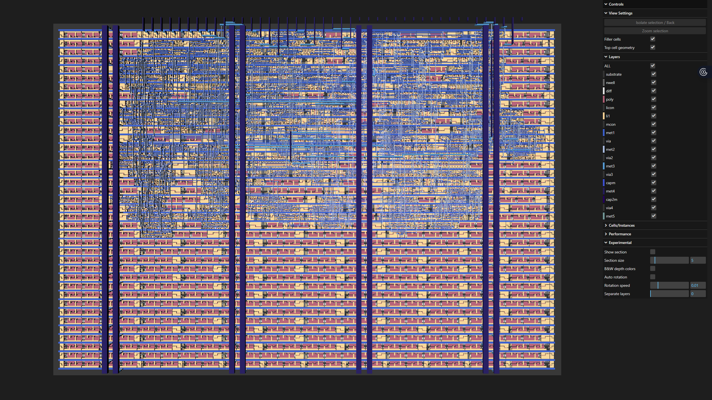
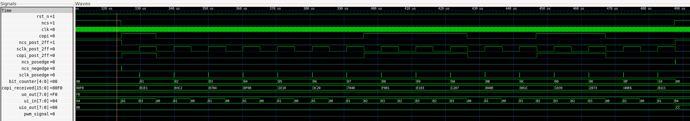
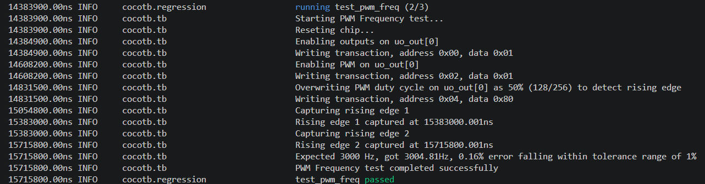

   

# SPI-Controlled PWM Peripheral Chip


A 16-channel SPI-controlled PWM peripheral chip following the SKY130 PDK and Tiny Tapeout's standard tile interface. The design accepts SPI commands to configure output enable and PWM mode on a per-pin basis across 16 output channels, and generates a ~3 kHz PWM signal with configurable duty cycle.

This was my very first silicon tapeout project to help me explore RTL design and verification.

I worked on this project between May - June 2026 in order to join the University of Waterloo ASIC design team when I start first-year university in September 2026.

---
## Table of Contents

- [What I learned](#what-i-learned)
- [Peripheral Chip Architecture](#peripheral-chip-architecture)
- [GDS View](#gds-view)
- [Overall Project Structure](#overall-project-structure)
- [Register Map](#register-map)
- [SPI Protocol](#spi-protocol)
- [PWM Generation](#pwm-generation)
- [Clock Domain Crossing](#clock-domain-crossing)
- [Verification](#verification)
- [Challenges I faced and Solutions](#challenges-i-faced-and-solutions)
- [Tools and Environment](#tools-and-environment)
- [Continuous Integration Workflows](#continuous-integration-workflows)
- [License](#license)

---

## What I learned

Overall, this project was definitely a bit confusing at first but very fun and rewarding! 

I gained a lot of insights into communication protocols, signal management and mapping, metastability resolution techniques, automated testbenching setups, terminal logging, RTL design and verification workflow, etc.

> ___Tools learned:___ Verilog, Cocotb, GTKWave, Icarus Verilog, Makefile, WSL, Terminal Logging, Github Actions Workflow, Tiny Tapeout Interface Standard, SkyWater 130 nm PDK

> ___Concepts learned:___ SPI Protocol, RTL Verification and Testbenching, Register Mapping, PWM, CDC, Metastability, Bit-banging, Signal Verification, Edge Detection, Synchronizers

---

## Peripheral Chip Architecture

This diagram shows the entire peripheral chip and how it is emcompassed in the testbenching workflow using Cocotb and Icarus Verilog:



The design is composed of three Verilog modules instantiated under the standard Tiny Tapeout top-level interface.

The top-level module `tt_um_uwasic_zjj` wires the TT standard ports to the two peripherals. The SPI peripheral decodes incoming transactions and drives five configuration registers as wires into the PWM peripheral. The PWM peripheral uses those registers to control a 16-bit output bus, mapped to a concatenated vector of `uo_out[7:0]` and `uio_out[7:0]`.

Pin assignments on `ui_in`:

| Pin | Signal |
|-----|--------|
| `ui_in[0]` | SCLK |
| `ui_in[1]` | COPI |
| `ui_in[2]` | NCS |

---

## GDS View

Use this link for a proper interactive 3D render of the GDS (ctrl + click to open in new tab): https://entropify.github.io/spi-pwm-controller-uwasic/



---

## Overall Project Structure 
(Unimportant files omitted)
```
|
├── src/
│   ├── project.v           # Top-level module (tt_um_uwasic_zjj)
│   ├── spi_peripheral.v    # SPI receiver + register file + sync_2ff CDC submodule
│   └── pwm_peripheral.v    # PWM signal generator and output mux
└──test/
    ├── test.py             # Cocotb testbenches (test_spi, test_pwm_freq, test_pwm_duty)
    ├── tb.v                # Verilog testbench
    └── Makefile            # Cocotb build and run config

```
---

## Register Map

All registers reset to `0x00` when `rst_n` is pulled to low and are written via SPI write transactions. Read transactions are not supported and are silently ignored.

| Address | Register | Description | Reset Value |
|---------|----------|-------------|----------------|
| `0x00` | `en_reg_out_7_0` | Output enable for `uo_out[7:0]` | `0x00` |
| `0x01` | `en_reg_out_15_8` | Output enable for `uio_out[7:0]` | `0x00` |
| `0x02` | `en_reg_pwm_7_0` | PWM mode enable for `uo_out[7:0]` | `0x00` |
| `0x03` | `en_reg_pwm_15_8` | PWM mode enable for `uio_out[7:0]` | `0x00` |
| `0x04` | `pwm_duty_cycle` | PWM duty cycle: `0x00` = 0%, `0xFF` = 100%, accepts any value between 0-255| `0x00` |

Output behavior per pin is determined by two control bits:

| Output Enable | PWM Mode | Result |
|---------------|----------|--------|
| 0 | X | Output forced low |
| 1 | 0 | Output follows enable bit (static high) |
| 1 | 1 | Output follows PWM signal |

---

## SPI Protocol

The SPI peripheral implements a subset of SPI Mode 0 (Clock Polarity = 0, Clock Phase = 0). Each transaction is 16 bits wide:

```
Bit 15    : R/W (1 = write, 0 = read)
Bits 14:8 : 7-bit address
Bits 7:0  : 8-bit data
```
Example transmission value:
```
1000 0100 0000 1111 or 0x840F
```


Transactions are initialized by NCS going low at the start and high at the end. The 16 data bits are clocked in MSB-first on the rising edge of SCLK. The register is written on the rising edge of NCS after all 16 bits have been received. Writes to addresses above `0x04` are silently ignored. Read transactions (R/W bit = 0) are accepted but produce no output.

Internally, a 16-bit shift register `copi_received[15:0]` accumulates incoming bits and is implemented with a saturation guard to ensure `bit_counter == 16` before committing.

A 5-bit `bit_counter` tracks the position of the currently transmitted bit. It reset on each NCS falling edge and increments on each SCLK rising edge while NCS is low.

---

## PWM Generation

The PWM signal is generated in `pwm_peripheral.v` using a two-stage counter:

```verilog
localparam clk_div_trig = 12; //a local parameter to be easily modified for different PWM periods as needed
reg [10:0] clk_counter;
reg [7:0]  pwm_counter;

wire pwm_signal = (pwm_duty_cycle == 8'hFF) ? 1'b1 : (pwm_counter < pwm_duty_cycle);
```

`clk_counter` increments every clock cycle and resets at 12, incrementing `pwm_counter` on each rollover. `pwm_counter` is 8-bit and rolls over at 256, giving a PWM period of:

```
period = (clk_div_trig + 1) x 256 = 13 x 256 = 3328 peripheral module internal clock cycles
```

At the clock frequency of ~9.984 MHz (basically 10 MHz):

```
PWM frequency = 9,984,000 / 3328 = approximately 3004.8 Hz
```

Duty cycle is set by `pwm_duty_cycle` register `(0x04)`. For a given value N, the signal is high for N out of every 256 counts:

```
% high in duty cycle = N / 256 x 100%
```

A special implementation exists for edge case `0xFF`: rather than computing 255/256 = 99.6%, the `pwm_signal` wire forces a constant high, giving a true 100% duty cycle. Edge case `0x00` naturally produces 0% since `pwm_counter < 0` is never true.

Each of the 16 output pins is independently muxed by its corresponding output enable and PWM mode bits. For example, `out[0]` is driven as:

```verilog
if (en_reg_pwm_7_0[0]) out[0] <= (pwm_signal) ? en_reg_out_7_0[0] : 1'b0;
```

---

## Clock Domain Crossing

The SPI bus (SCLK, COPI, NCS) is asynchronous to the system clock. To safely sample these signals and avoid ***metastability***, each is passed through a `sync_2ff` module I built which is a two flip-flop synchronizer:

This introduces two cycles of latency but eliminates ***metastability*** risk. Edge detection is done combinationally by comparing to a one `clk` cycle delayed register after the `sync_2ff` and the current signal in the second flip-flop:

```verilog
assign sclk_posedge = sclk_post_2ff & ~sclk_last;
assign ncs_posedge  = ncs_post_2ff  & ~ncs_last;
assign ncs_negedge  = ~ncs_post_2ff &  ncs_last;
```

The COPI line uses level sampling rather than edge detection, since its value only needs to be read on SCLK rising edges.

---

## Verification

Verification was written in Python using [cocotb](https://www.cocotb.org/) with [Icarus Verilog](https://github.com/steveicarus/iverilog) as the simulator. Three test functions cover the full design implemented with `async` Python functions and `await` to run simulation in parallel:

### test_spi

Verifies the SPI register file. Tests include:

- Write to valid addresses (`0x00`, `0x01`, `0x02`, `0x04`) and assert register values appear on the correct output pins
- Write to invalid address (`0x30`) and verify outputs are unchanged
- Read transactions (R/W = 0) are ignored and don't overwrite existing register values

### test_pwm_freq

Verifies that the PWM outputs at the correct frequency. Setup writes to registers `0x00`, `0x02`, and `0x04` to enable output and PWM mode on `uo_out[0]` with a 50% duty cycle. Two consecutive rising edges are captured and the period is measured. The frequency is then calculated to compared to the expected frequency of 3000 , with 1% error tolerance.

```python
period = t_rising_edge2 - t_rising_edge1          
frequency = (1 / period) * 1e9                    
assert 3000 * 0.99 < frequency < 3000 * 1.01
```

### test_pwm_duty

Verifies duty cycle accuracy at 50%, 0%, and 100%. The 50% case captures a rising edge, falling edge, and second rising edge to compute how long the PWM was high for (`high_time`):

```python
high_time  = t_falling_edge - t_rising_edge1
period     = t_rising_edge2 - t_rising_edge1
duty_cycle = (high_time / period) * 100
assert 50 * 0.99 < duty_cycle < 50 * 1.01
```

The 0% and 100% edge cases are verified by sampling `uo_out[0]` 12 times across about 36,000 clock cycles and `assert`ing the output is constant low or constant high respectively.

### Example Screenshots of GTKWave and Terminal Logs Post-verification

Example waveform during test_spi write tests:

 

Example logs during test_pwm_freq:



---

## Challenges I faced and Solutions

### 1. Clock Domain Crossing on SPI Signals

The SPI bus runs in a different clock domain from the system clock (simulated `sclk` from master is 100 KHz whilst internal `clk` of the SPI module is at a much higher ). Natively registering SCLK or NCS on a system clock edge risks sampling during a metastable transition which violates T<sub>su</sub> and T<sub>H</sub> and potentially causes a metastable signal to propagate in the chip. 

The solution was a `sync_2ff` two-flip-flop synchronizer on all three SPI input signals to greatly decrease the probability that when the value on the flip-flop is sampled on the next `clk` edge, T<sub>CO</sub> hasn't ended. Edge detection is then performed on the synchronized outputs, ensuring all downstream logic operates cleanly in the system clock domain.

### 2. SPI Shift Register and Counter Bugs

After completing the initial implementation, a UW ASIC lead reviewed the design and identified some issues in `spi_peripheral.v`:

__Indexed write to register__

The original implementation used an indexed write to accumulate incoming COPI bits. This was replaced with a proper shift register, which is the standard hardware pattern for serial data accumulation:

```verilog

copi_received <= {copi_received[14:0], copi_post_2ff};

```

__4-bit counter overflow__

The original `bit_counter` was 4 bits wide, meaning it would wrap from 15 back to 0 if extra SCLK edges arrived before NCS deasserted. This would cause earlier received bits to be overwritten, corrupting `copi_received`. The counter was widened to 5 bits and a saturation guard was added. The register write on NCS rising edge is now only committed if exactly 16 bits were received:

```verilog

if (ncs_posedge && bit_counter == 16) begin
    // code omitted
end

```

In practice, this bug never triggered during testing because the cocotb `send_spi_transaction` helper always sends exactly 16 bits and immediately deasserts NCS — so bit_counter never had the opportunity to reach 16 and wrap before the transaction ended. However, a real SPI master on hardware is not guaranteed to behave this cleanly. Widening to 5 bits and adding the saturation guard ensures the design is safe against inaccurate or extended transactions from the master chip.

For the future, I realized a dedicated test sending incorrect transactions (fewer than 16 bits, more than 16 bits, or NCS deasserted mid-transaction) would provide more extended testing for the peripheral chip's ability to handle errors.

### 3. Cocotb VPI Limitation with Wire Signals

The cocotb `RisingEdge` and `FallingEdge` triggers work by registering a value change callback with the simulator via VPI. The version of Icarus Verilog I was using apparently did not support these callbacks on `wire` nets driven by submodule output ports, producing the error:

```
make_value_change: sorry: I cannot callback values on type code=37
```

Since `uo_out` in `tb.v` is a wire driven by module `tt_um_uwasic_zjj`, `RisingEdge(dut.uo_out)` hangs the entire test bench during runtime. The solution was to write my custom edge detection functions with manual polling loops that check `dut.uo_out.value & 0x01` on every clock cycle:

```python
async def wait_for_rising_edge(dut):
    prev = dut.uo_out.value & 0x01
    while True:
        await ClockCycles(dut.clk, 1)
        curr = dut.uo_out.value & 0x01
        if curr == 1 and prev == 0:
            break
        prev = curr
```

Initializing `prev` from the current signal value rather than hardcoding 0 was very important as I encountered another bug when I first hardcoded `prev = 0`. 

This caused false edge detection on the first clock cycle when the signal was already high, resulting in a measured frequency exactly equal to the system clock and a ridiculously high error percentage of 333233.33% for the `pwm_frequency` test (I laughed out loud when I saw that number on the terminal 😭✌️).

### 4. Cocotb Version Pinning

The simulation environment runs Python 3.14. Cocotb 2.x introduced breaking changes that are incompatible with Python 3.14 at the time of this project. Cocotb had to be pinned to version 1.9.2 in `requirements.txt` to maintain a stable environment.

---

## Tools and Environment

| Tool | Version / Details |
|------|-------------------|
| Verilog simulator | Icarus Verilog |
| Testbench framework | cocotb 1.9.2 |
| Python | 3.14 (WSL Ubuntu) |
| Waveform viewer | GTKWave |
| ASIC flow | OpenLane2 |
| Process node | SkyWater SKY130 |
| Tapeout platform | Tiny Tapeout 10 |
| Layout viewer | Tiny Tapeout GDS viewer |

---

## Continuous Integration Workflows 

(provided by UWASIC and Tiny Tapeout)
Four GitHub Actions workflows run automatically on push:

| Workflow | Trigger | Description |
|----------|---------|-------------|
| `docs` | Push | Builds project documentation from `info.yaml` |
| `test` | Push | Runs cocotb testbenches, uploads VCD and results XML |
| `fpga` | Manual | Synthesizes iCE40UP5K bitstream for TT ASIC emulation |
| `gds` | Push | Runs OpenLane2, precheck, gate-level simulation, and deploys GDS layout viewer to GitHub Pages |

All four workflows passed as shown at the top of this README in badges.

---

## License

SPDX-License-Identifier: Apache-2.0

Copyright (c) 2026 Zhiyuan (Jerry) Jiang — design and testbench

Copyright (c) 2024 Tiny Tapeout — project template and CI workflows
